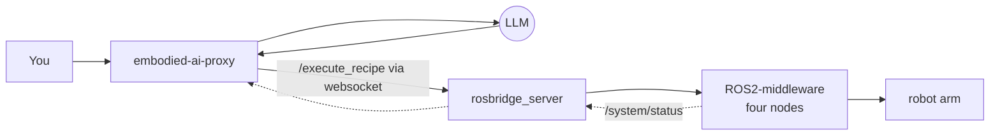
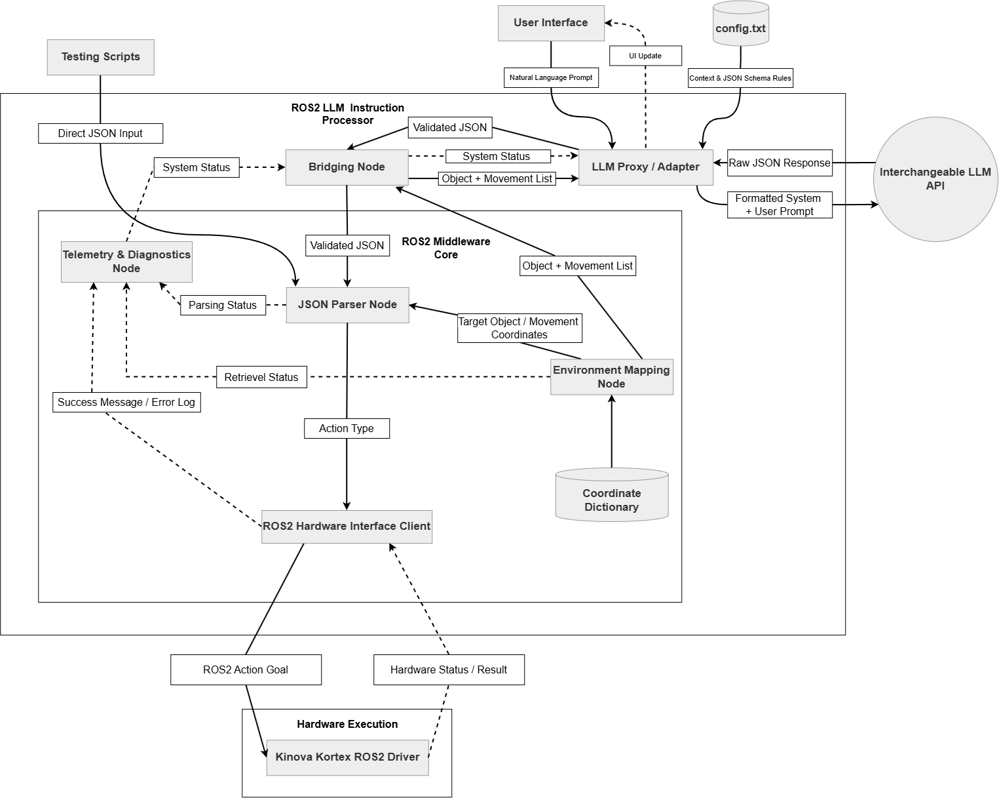
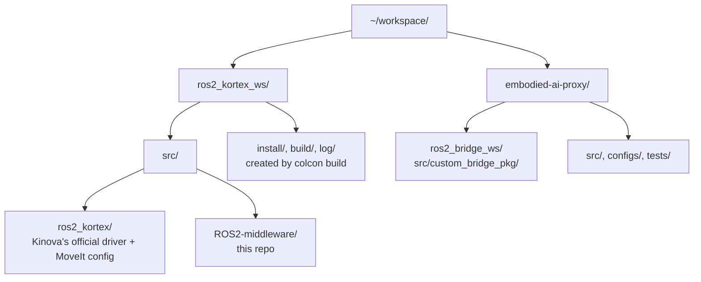

[Docs Home](README.md)

# Architecture

## Full pipeline



This is the quick-glance version. For the full detailed diagram, node by node with every service call labeled:



The proxy never calls a ROS 2 service directly. Every request goes out over the websocket to `rosbridge_server`, which translates it into a real service call against this middleware. Telemetry flows back the same way (the dashed path above), `rosbridge` subscribes to `/system/status` on the proxy's behalf and forwards messages back over the websocket.

## ROS 2 concepts you need before you start

You don't need to be a ROS 2 expert, but these four words will come up constantly, so here's what they mean in plain English:

- **Node**: a single running program. The middleware ships four of them, see [Overview](overview.md).
- **Topic**: a one-way broadcast channel. Publishers shout messages onto a topic; subscribers listen. Nobody waits for a reply. (Used here for the heartbeat/telemetry messages.)
- **Service**: a request/response call, like a function call over the network. You call it, it does something, it replies. (Used here for almost everything: "give me coordinates for X," "move the arm," "execute this recipe.")
- **Action**: like a service, but for things that take a while and report progress along the way. For example, "move the arm": MoveIt reports planning and monitoring progress before finally succeeding or failing. Only `hardware_interface_client.py` uses actions directly; everything else in the system only ever sees simple services.
  
## Middleware node deep dive

**`hardware_interface_client.py`, the only node that touches the robot:**
- Exposes five services under its private namespace: `/kinova_hardware_client/home_arm`, `move_arm`, `move_gripper`, `relative_move`, `joint_move`.
- The only node that *executes* motion. Other code may query MoveIt (IK, FK, state validity, planning scene), but every arm or gripper movement goes through this node.
- Internally a client of two ROS 2 actions: `move_action` (MoveIt 2's `MoveGroup`, for Cartesian moves and the fixed joint-space `home` pose) and `/gen3_lite_2f_gripper_controller/gripper_cmd` (direct gripper control, bypassing MoveIt entirely).
- Movement calls block synchronously on a `threading.Event()` until the action's result callback fires, which is what makes each recipe step wait for the robot to actually finish.
- Subscribes to `/fault_controller/is_faulted` to know instantly if the arm enters a hardware fault state.

**`environment_mapping_node.py`, the read-mostly knowledge base:**
- Loads `object_dictionary.json`, `relative_movement.json`, `orientation_presets.json`, and `obstacles.json` once at startup. No live file-watching; a config change needs a restart.
- Exposes `/get_coordinates`, `/get_object_info`, `/get_relative_movement`, `/get_orientation_preset`, `/get_robot_parameters`, all pure lookups against the in-memory data.
- Separately pushes every entry in `obstacles.json` into MoveIt's planning scene once `/apply_planning_scene` becomes available.

**`json_parser_node.py`, orchestration:**
- Loads a recipe two ways: a static file via the `recipe` launch parameter, or a dynamic JSON string via the `/execute_recipe` service, which is exactly what the proxy calls at runtime.
- Iterates recipe steps in order, stopping at the first failure.
- Dispatches each step to an action in `kinova_interface/actions/` (see the layout below). Actions call the hardware and environment nodes' services, and query MoveIt services directly (`/compute_ik`, `/compute_fk`, `/check_state_validity`, `/get_planning_scene`, `/apply_planning_scene`), but never execute motion themselves.
- Each action returns `(success, message)`. On failure, `/execute_recipe` returns the failing step, its action and the reason, for example `Recipe failed at step 2 (pickup): Failed to move to object position: <MoveIt error>`.

**`telemetry_node.py`, pure aggregation:**
- Subscribes to `/status/node_report`, publishes an aggregated `/system/status` every 0.5s using a worst-case-wins rule across all tracked nodes.
- Hosts `/system/reset_fault`, forwarding to the real Kortex driver's own reset service.
- Automatically reconfigures and reactivates the hardware fault controller in the background if it detects the known driver startup race condition (the physical driver takes several seconds to establish its connection, which otherwise leaves `fault_controller` stuck unconfigured).

## Proxy internals

The proxy's own components (`llm_proxy.py`, the LLM adapters, `ros2_bridge_ws`, the Textual terminal interface) are documented in the embodied-ai-proxy repository itself: [github.com/paul-isit/embodied-ai-proxy](https://github.com/paul-isit/embodied-ai-proxy). This page covers this middleware's own internals in depth; the pipeline diagram above is the shared context between the two.

## Custom interface types (middleware)

**Services** (request fields above the separator, response fields below):

| Service | Request | Response |
|---|---|---|
| `HomeArm` | `motion_params` (`MotionParams`) | `success`, `message` |
| `MoveArm` | `target_position` (`Point`), `has_orientation` (bool), `roll`, `pitch`, `yaw` (float64), `motion_params` (`MotionParams`) | `success`, `message` |
| `MoveGripper` | `position` (float64) | `success`, `message` |
| `RelativeMove` | `vx`, `vy`, `vz` (float64), `roll_delta`, `pitch_delta`, `yaw_delta` (float64), `motion_params` (`MotionParams`) | `success`, `message` |
| `GetObjectCoordinates` | `object_id` (string) | `x`, `y`, `z`, `success`, `message` |
| `GetObjectInfo` | `object_id` (string) | `pose` (`Pose`), `shape` (`SolidPrimitive`), `success`, `message` |
| `GetRelativeMovement` | `move_id` (string) | `x`, `y`, `z`, `success`, `message` |
| `GetOrientationPreset` | `preset_name` (string) | `roll`, `pitch`, `yaw`, `success`, `message` |
| `GetRobotParameters` | (none) | `object_list[]`, `movement_names[]`, `orientation_names[]` |
| `JointMove` | `joint_positions[]` (float64), `wait_for_completion` (bool), `relative` (bool), `motion_params` (`MotionParams`) | `success`, `message` |
| `ExecuteRecipe` | `recipe_json` (string) | `success`, `message` (the failing step, action and reason on failure) |

`MoveArm`'s `has_orientation` defaults to `false`: no orientation constraint, MoveIt picks the orientation, and the move is planned with OMPL RRT* since Pilz needs a full pose. `RelativeMove` always keeps the current orientation (plus any deltas), so it has no such flag.

**Messages** (published continuously, not request/response):

- `ExtendedStatus`: one node's heartbeat: `node_name`, `state` (0 = IDLE, 1 = BUSY, 2 = FAULT), `status_message`, `last_command_valid`.
- `SystemSummary`: the aggregated view: `summary_state` plus `individual_states[]`.
- `MotionParams`: not published on its own, a shared field type embedded in `HomeArm`, `MoveArm`, and `RelativeMove` requests: `velocity_scale`, `acceleration_scale` (float64), each `0.0` to `1.0`. `0.0` (the default) means full speed, values are clamped into range on the receiving end.

## Where everything lives on disk

The middleware doesn't stand alone, it builds inside a workspace alongside Kinova's own driver stack, while the proxy lives entirely separately:



See [Installation](installation.md) for how this layout gets built up step by step.

## Package layout reference

```
ROS2-middleware/
  README.md
  docs/                          this documentation
  kinova_interface/
    data/configs/env/            object_dictionary.json, relative_movement.json, orientation_presets.json, obstacles.json
    kinova_interface/             the Python package
      nodes/                      the four ROS nodes (entry points)
      actions/                    one module per recipe action (pickup.py, pour.py, ...) + arm_actions.py, their shared service clients/helpers
      utils/                      shared pure helpers: robot.py (frame, joint and link names), geometry.py (math), ros.py (service-call helpers)
    scripts/run_recipe.py         send a recipe file to /execute_recipe (ros2 run kinova_interface run_recipe.py <file>)
    scripts/check_orientations.py move to a grid of poses per orientation preset and check the reached orientation (see testing.md)
    launch/robot.launch.py
    recipes/                      task_recipe.json, test_suite/
  kinova_interfaces/
    srv/, msg/                    custom service and message definitions

embodied-ai-proxy/
  main.py                         entry point, launches the TUI
  evaluate_proxy.py                YAML-based LLM evaluation runner
  configs/
    llm_config.json                LLM provider configuration
    system_prompt.md               LLM behavior rules and few-shot examples
    json_schema.json               strict output schema
  ros2_bridge_ws/
    src/custom_bridge_pkg/         launches rosbridge_server
  src/
    backend/
      llm_proxy.py                 main orchestrator
      defaults.py                  dead fallback prompt
      llm_adapters/                one file per provider
    frontend/
      tui_app.py                   terminal interface
      components/                  input bar, log panel, sidebar, status panel
  tests/                           basic_tests.yaml, test_cases.yaml
```

Next: [Safety and Contracts](safety-and-contracts.md)
