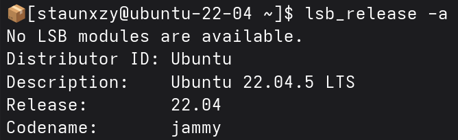

# Non-Native Ubuntu Environment Setup

This document explains how to prepare a non-Ubuntu host environment for development.

The project environment is based on **Ubuntu 22.04 (Jammy)** and **ROS 2 Humble**. If you are already running Ubuntu 22.04 natively, you can skip this document and proceed directly to [`installation.md`](./installation.md).

This document covers the setup required for:

* [macOS](#4-virtual-machine-windows--macos)
* [Windows](#3-wsl-2-windows)
* [Other Linux distributions](#2-linux-distrobox)

---

## 1. Determine Your Environment

Choose the setup appropriate for your host operating system.

| Host OS                   | Recommended approach |
| ------------------------- | -------------------- |
| Other Linux distributions | Distrobox            |
| Windows 10                | WSL 2 / Virtual Machine|
| macOS                     | Virtual Machine      |

---

## 2. Linux: Distrobox

[Distrobox](https://distrobox.it/) is recommended for Linux distributions other than Ubuntu 22.04.

Distrobox allows an Ubuntu userspace to run inside the existing Linux host while retaining access to much of the host's:

* Filesystem
* Network
* Hardware
* Graphical environment
* User configuration

This is particularly useful for distributions such as Fedora, where the host operating system is different from the Ubuntu environment expected by the project.

### 2.1 Install Distrobox

Install Distrobox via hosts package manager. For example, on Fedora

```bash
sudo dnf install distrobox
```

### 2.2 Create Ubuntu 22.04 Container

Create a Distrobox container using Ubuntu 22.04

```bash
distrobox create --name ubuntu-22-04 --image ubuntu:22.04
```

Enter the container

```bash
distrobox enter ubuntu-22-04
```

Verify the Ubuntu version from within the container

```bash
lsb_release -a
```



This should return Ubuntu 22.04
A version number should be displayed.

If the command is not found, Distrobox has not been installed correctly.

### 2.3 Initial Container Setup

Inside the container, update the package lists:

```bash
sudo apt update
```

Install basic development utilities:

```bash
sudo apt install -y git curl wget build-essential python3 python3-pip
```

Do not install the project's ROS 2 dependencies here unless instructed by [`installation.md`](./installation.md).

### 2.4 USB and Camera Access

Distrobox can provide access to host hardware, but availability depends on the host configuration.

This is particularly important for the computer-vision components of the project, which may use:

* USB webcams
* Depth cameras
* Intel RealSense cameras
* Other USB peripherals

First verify that the device is detected by the host operating system.

For cameras, check:

```
ls /dev/video*
```

For USB devices, check:

```
lsusb
```

If the device is visible on the host but not inside the Distrobox container, additional device configuration may be required.

### 2.5 Re-entering the Environment

Once the container has been created, it does not need to be recreated each time.

Enter the existing environment with:

```
distrobox enter ubuntu-22-04
```

---

## 3. WSL 2 (Windows)

Windows users can use **WSL 2 (Windows Subsystem for Linux 2)** to provide the Ubuntu environment.

The recommended configuration is:

```text
Windows
   │
   ▼
WSL 2
   │
   ▼
Ubuntu 22.04
   │
   ▼
ROS 2 Humble
```

### 3.1 Install WSL 2

Open PowerShell as Administrator and run:

```
wsl --install
```

Restart Windows if requested.

Verify the installation:

```
wsl --status
```

WSL 2 should be enabled.

### 3.2 Install Ubuntu 22.04

Install Ubuntu 22.04:

```
wsl --install -d Ubuntu-22.04
```

List installed distributions:

```
wsl --list --verbose
```

The Ubuntu distribution should show:

| Distribution | VERSION |
| ------------ | ------: |
| Ubuntu-22.04 |       2 |

If necessary, set WSL 2 as the default:

```
wsl --set-default-version 2
```

### 3.3 Enter Ubuntu

Start Ubuntu from the Windows Start menu or run:

```
wsl -d Ubuntu-22.04
```

Inside Ubuntu, verify:

```
cat /etc/os-release
```

The environment should report Ubuntu 22.04.

### 3.4 Filesystem Considerations

WSL exposes Windows drives under `/mnt`.

For example, the Windows `C:` drive is normally available at:

```
/mnt/c/
```

For ROS 2 development, keep the active ROS 2 workspace inside the Linux filesystem where possible.

Recommended:

```
~/workspace/ros2_kortex_ws
```

Avoid placing the active ROS 2 workspace under:

```
/mnt/c/...
```

unless there is a specific reason to do so.

Keeping the workspace within the Linux filesystem generally provides better filesystem performance and avoids issues associated with building Linux software directly on a Windows-mounted filesystem.

### 3.5 GUI and RViz

Modern WSL installations include WSLg, which provides Linux GUI application support.

Check the display environment:

```
echo $DISPLAY
```

and:

```
echo $WAYLAND_DISPLAY
```

If RViz fails to start, verify that WSLg is functioning before troubleshooting the ROS 2 installation.

### 3.6 Camera and USB Hardware

USB hardware access through WSL is different from running Ubuntu natively.

A USB device being detected by Windows does not automatically mean that it is available inside WSL.

This is particularly relevant to:

* USB webcams
* Depth cameras
* Intel RealSense cameras
* Robotic peripherals

USB/IP or other device-passthrough configuration may be required.

If the project is being tested using recorded camera data rather than a physical camera, direct USB passthrough may not be required.

---

## 4. Virtual Machine (Windows / macOS)

A virtual machine can be used when Distrobox or WSL is unsuitable.

This is particularly relevant for **macOS**, where a Linux virtual machine can provide a complete Ubuntu environment.

The general configuration is:

```text
Host Operating System
        │
        ▼
Virtual Machine
        │
        ▼
Ubuntu 22.04
        │
        ▼
ROS 2 Humble
```

Possible virtualisation platforms include:

* UTM
* Parallels
* VMware
* VirtualBox

The exact setup depends on the host operating system and hardware architecture.

### 4.1 Install Ubuntu 22.04

Install:

[**Ubuntu Desktop 22.04 LTS**](https://ubuntu.com/tutorials/install-ubuntu-desktop#1-overview)

The virtual machine should provide a complete Ubuntu 22.04 environment.

Do not attempt to install the project's Ubuntu-specific ROS 2 environment directly onto macOS or Windows.

### 4.2 VM Resources

The VM should have sufficient resources to run ROS 2, RViz, and the project's development tools.

As a starting point:

| Resource |             Recommended |
| -------- | ----------------------: |
| CPU      |                4+ cores |
| RAM      |            8 GB minimum |
| Storage  |                  40 GB+ |
| Graphics | 3D acceleration enabled |

Simulation and computer-vision workloads may benefit from allocating additional resources.

### 4.3 Network Access

The Ubuntu VM must have working internet access.

Inside Ubuntu, test:

```
ping -c 3 google.com
```

If this fails, resolve the VM networking issue before proceeding with [`installation.md`](./installation.md).

### 4.4 Shared Folders

A shared folder can be configured if files need to be exchanged between the host and Ubuntu VM.

However, the recommended approach for ROS 2 development is to clone and build the project inside the Ubuntu filesystem:

```
/home/<user>/workspace/
```

Avoid building the ROS 2 workspace directly from a host-mounted filesystem unless required.

### 4.5 USB Devices

If physical cameras or robotic hardware are required, configure USB passthrough from the host to the virtual machine.

Verify that the device is visible inside Ubuntu.

For USB devices:

```
lsusb
```

For cameras:

```
ls /dev/video*
```

If the device is not visible, resolve the USB passthrough configuration before troubleshooting the ROS 2 software.

---

## 5. Verify the Environment Before Installation

### Operating System

```
cat /etc/os-release
```

The environment should identify:

```
Ubuntu 22.04
```

### Architecture

```
uname -m
```

The architecture should be compatible with the selected Ubuntu and ROS 2 environment.

### Internet Connectivity

```
ping -c 3 google.com
```

### Git

```
git --version
```

### Python

```
python3 --version
```

### Home Directory

```
echo $HOME
```

The ROS 2 workspace should preferably be located within the Linux filesystem.

---

## 6. Environment-Specific Considerations

Non-native Ubuntu environments can provide a suitable development and simulation environment, but they may have limitations compared with native Ubuntu.

| Environment         | Main consideration                                                        |
| ------------------- | ------------------------------------------------------------------------- |
| Native Ubuntu 22.04 | Most direct hardware and Linux integration                                |
| Distrobox           | Generally good host integration; hardware access depends on configuration |
| WSL 2               | USB and hardware access may require additional configuration              |
| Virtual Machine     | USB passthrough and graphics acceleration require VM configuration        |

For this project, the most important considerations are:

1. **Camera access**
2. **USB device access**
3. **Graphical display support**
4. **OpenGL/3D acceleration for RViz**
5. **Network connectivity**
6. **Filesystem performance**

These should be verified before attempting to diagnose problems with ROS 2 or the project itself.

---

## 7. Troubleshooting

### Ubuntu Version Is Incorrect

Check:

```
cat /etc/os-release
```

The environment should be Ubuntu 22.04.

For Distrobox, verify that the container was created from:

```
ubuntu:22.04
```

For WSL, verify:

```
wsl --list --verbose
```

For a VM, verify the Ubuntu installation from within the VM.

---

### ROS 2 Commands Are Not Found

First verify the operating environment:

```
cat /etc/os-release
```

If Ubuntu 22.04 is not being used, resolve the environment configuration before continuing.

If Ubuntu 22.04 is correct, proceed to [`installation.md`](./installation.md) and follow the ROS 2 installation procedure.

---

### RViz Cannot Open

Check the display environment:

```
echo $DISPLAY
echo $WAYLAND_DISPLAY
```

For WSL:

* Verify that WSLg is functioning.
* Verify that Linux GUI applications can launch.

For Distrobox:

* Verify that the host graphical environment is being passed through.
* Verify the relevant display variables.

For a VM:

* Enable 3D acceleration.
* Verify that the virtual graphics adapter is working.
* Ensure the VM has sufficient graphics resources.

---

### Camera Is Not Detected

First determine whether the host operating system detects the camera.

Inside Ubuntu, check:

```
ls /dev/video*
```

and:

```
lsusb
```

If the camera is detected by the host but not inside Ubuntu, the issue is likely related to device passthrough or hardware integration rather than ROS 2.

---

### Workspace Builds Slowly or Behaves Unexpectedly

Check where the workspace is located:

```
pwd
```

For WSL, avoid building the workspace directly under:

```
/mnt/c/
```

For virtual machines and Distrobox, prefer a workspace inside the Ubuntu user's home directory:

```
~/workspace/ros2_kortex_ws
```

---
