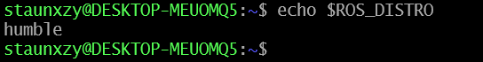

[Docs Home](README.md)

# Installation

## What you need on your machine

| Requirement | Version | Why |
|---|---|---|
| Operating System | Ubuntu 22.04 LTS | ROS 2 Humble targets this release |
| ROS 2 distribution | Humble Hawksbill | This is the ROS 2 version both repositories are written against |
| Python | 3.10+ | Ships with Ubuntu 22.04; used natively by ROS 2 Humble and by the proxy |
| colcon | (installed with ROS 2 dev tools) | The build tool used to compile/install ROS 2 packages |
| RAM | 8GB minimum, 32GB recommended | Higher end needed if you're running a larger local LLM through Ollama |
| Ollama | Latest, only if running a local LLM | Not needed if you're only using a cloud provider (OpenAI, Anthropic, Gemini) |

If you're on Windows or macOS, you'll need a Ubuntu 22.04 VM or WSL2 with Ubuntu 22.04. ROS 2 Humble is not natively supported elsewhere. Instructions to configure workspace with alternative OS is found in [Environment Setup](./environment-setup.md)

## 1. Install ROS 2 Humble

If you don't already have ROS 2 Humble installed, follow the official installation guide for your [Ubuntu Setup](https://docs.ros.org/en/humble/Installation/Alternatives/Ubuntu-Development-Setup.html)

After installing, every new terminal you use for this project needs the ROS 2 environment loaded:

```bash
source /opt/ros/humble/setup.bash
```

Verify that ROS Humble has been installed:

```bash
echo $ROS_DISTRO
# it should say `humble`
```


Tip: add this line to your `~/.bashrc` so you don't have to type it in every terminal.

```bash
echo "source /opt/ros/humble/setup.bash" >> ~/.bashrc
```

## 2. Set up your ROS 2 workspace and clone this repo

A ROS 2 "workspace" is just a folder with a specific structure that `colcon` knows how to build. Create one and put all the required source packages inside `src/`:

```bash
mkdir -p ~/workspace/ros2_kortex_ws/src
cd ~/workspace/ros2_kortex_ws/src

# The official Kinova driver + MoveIt config packages
git clone -b humble https://github.com/Kinovarobotics/ros2_kortex.git

# This middleware repository
git clone https://github.com/Jeremy-Allan/ROS2-middleware.git
```
You can access the official [ROS 2 Kortex Repository](https://github.com/Kinovarobotics/ros2_kortex) here. After completing these steps, the expected project structure is as follows:

```bash
├── /workspace
    ├── /ros2_kortex_ws
        └── /src
           ├── /ROS2-Middleware
           ├── /embodied-ai-proxy
           └── /ros2_kortex
```

Your `src/` folder should now contain (at least) the `ros2_kortex` packages alongside this repo's two packages: `kinova_interface` (the Python nodes, launch file, recipes, config) and `kinova_interfaces` (the custom service/message type definitions).

> Note the naming: `kinova_interface` (singular, the nodes) and `kinova_interfaces` (plural, the custom `.srv`/`.msg` type definitions) are two separate ROS 2 packages that live side by side in this one Git repository. Don't confuse them: the launch file, entry points, and every `import` in the Python code depend on getting the singular/plural right.

## 3. Install ROS 2 dependencies with rosdep

From the root of your workspace, let ROS 2's dependency resolver install anything missing (MoveIt 2, `ros2_control`, `tf2_ros`, etc.):

```bash
cd ~/workspace/ros2_kortex_ws
sudo rosdep init      # only needed once per machine, ever
rosdep update
rosdep install --from-paths src --ignore-src -r -y
```

## 4. Build the workspace

```bash
cd ~/workspace/ros2_kortex_ws
# if this is the very first build of the whole workspace run just colcon build
colcon build
# otherwise to save build time, only build the packages which has code changes by using the `packages-select` flag
colcon build --packages-select kinova_interface kinova_interfaces
```

If this is the very first build of the whole workspace, drop `--packages-select ...` and just run `colcon build` once to compile everything, including the Kinova driver packages, which will take longer.

`kinova_interfaces` must build successfully before `kinova_interface`, because the Python nodes import the custom service/message types it generates (`HomeArm`, `MoveArm`, `ExtendedStatus`, etc.). Colcon handles this ordering automatically as long as both packages are in `src/`.

## 5. Source the workspace

Every terminal you use to run or interact with the middleware needs:

```bash
source /opt/ros/humble/setup.bash
source ~/workspace/ros2_kortex_ws/install/setup.bash
```

"Sourcing" loads environment variables that tell your shell where to find the compiled packages, message types, and executables. If you skip this, you'll get "package not found" or "unknown message type" errors.

## 6. Clone and set up the proxy

The proxy is a separate project with its own small internal ROS 2 workspace for the bridge. It does not live inside `ros2_kortex_ws`, clone it wherever you keep your projects:

```bash
cd ~/workspace
git clone https://github.com/paul-isit/embodied-ai-proxy.git
cd embodied-ai-proxy
```

Install the system-level bridge dependency:

```bash
sudo apt-get update
sudo apt-get install ros-humble-rosbridge-suite
```

Install the proxy's own Python dependencies:

```bash
pip install -r src/requirements.txt
```

Build the proxy's internal ROS 2 bridge workspace:

```bash
cd ros2_bridge_ws
colcon build
cd ..
```

Set `PYTHONPATH` so the proxy's own internal imports resolve correctly:

```bash
echo 'export PYTHONPATH=.' >> ~/.bashrc
source ~/.bashrc
```

> Important: that `PYTHONPATH=.` only works correctly if you run the proxy's Python commands (`main.py`, `evaluate_proxy.py`) from the repository root. Running them from any other directory will cause import errors.

## 7. Set up an LLM provider

The proxy needs a large language model to talk to. The default configuration expects a local Ollama model, which is free and needs no API key, but you can point it at OpenAI, Anthropic, or Gemini instead. Full provider configuration is covered in [Configuration](configuration.md); the short version for the free local path:

```bash
ollama run gemma3:1b
```

Once it's running, exit the chat session by typing `/bye`. Then host it so the proxy can reach it:

```bash
OLLAMA_HOST=0.0.0.0 ollama serve
```

Leave that terminal running. Verify it's reachable:

```bash
curl http://localhost:11434
```

It should respond `Ollama is running`.


Next: [Running the System](running.md)
